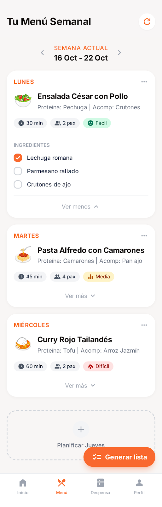
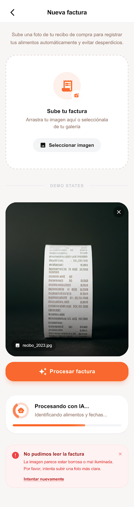
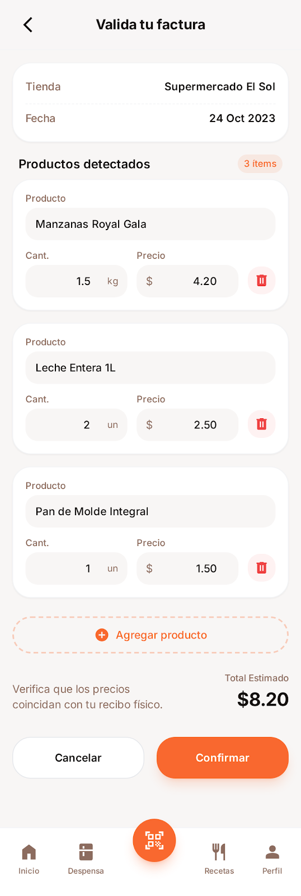
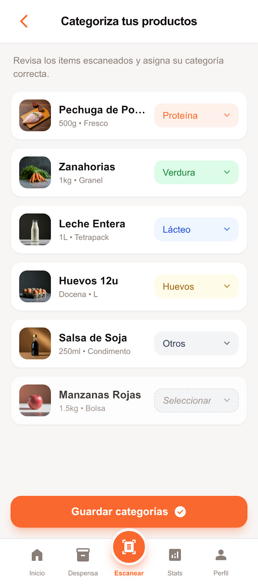
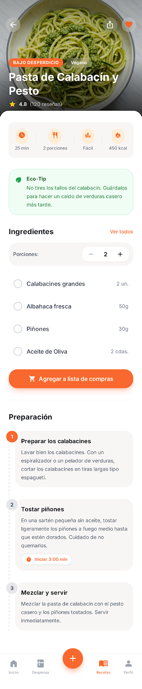
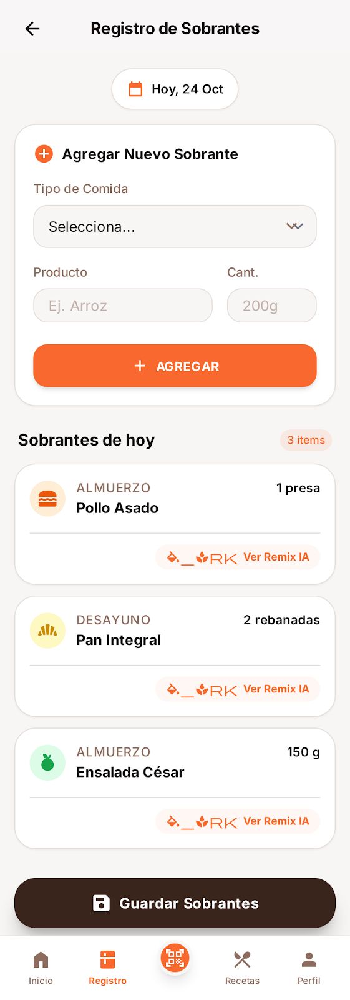
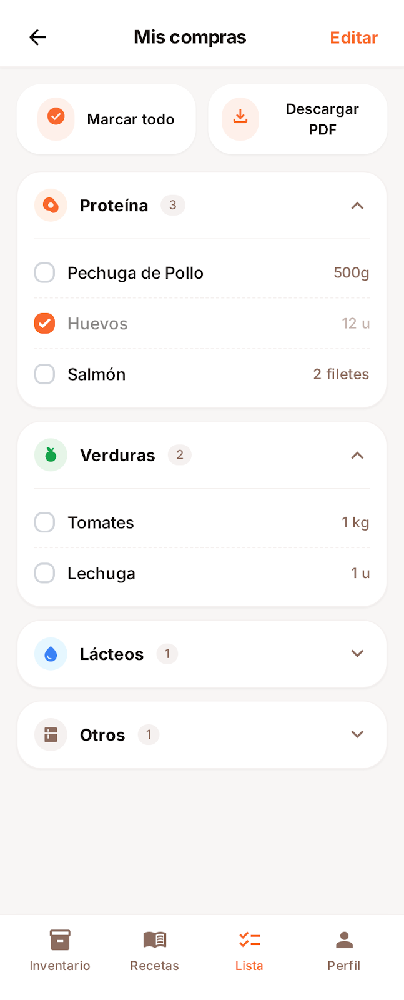
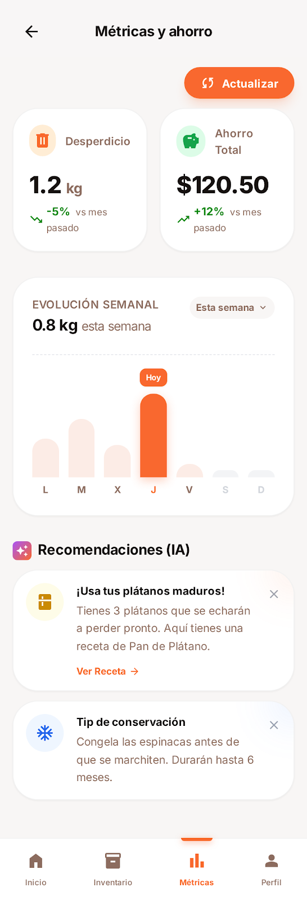

# Zerowaste - Tu Chefcito Inteligente

<div align="center">

**Planifica comidas, reduce desperdicios, ahorra dinero**

[](https://nextjs.org/)
[](https://reactjs.org/)
[](https://www.typescriptlang.org/)
[](LICENSE)

</div>

---

## ¿Qué es Zerowaste?

**Zerowaste** es una aplicación móvil-first impulsada por inteligencia artificial que revoluciona la forma en que las familias planifican sus comidas. Genera menús personalizados basados en preferencias familiares, restricciones dietéticas y productos disponibles, ayudándote a:

- **Planificar comidas en segundos** - La IA genera menús semanales completos
- **Reducir desperdicio hasta 30%** - Optimiza el uso de ingredientes
- **Ahorrar 15-20% en compras** - Listas de compras inteligentes
- **Comer más variado** - Descubre nuevas recetas adaptadas a tu familia

---

## Características Principales

### Planificación Inteligente con IA
Genera menús semanales completos en segundos considerando las preferencias de tu familia, restricciones alimentarias y productos disponibles en tu despensa.



### Configuración Familiar Personalizada
Define quién come en casa, restricciones dietéticas (vegetariano, sin gluten, vegano, etc.) e ingredientes a evitar para recibir recomendaciones 100% personalizadas.


### Escaneo de Facturas con OCR
Toma una foto de tu ticket del supermercado y la IA extrae automáticamente todos los productos, cantidades y precios usando GPT-4o Vision.

<div align="center">
  
  
  
</div>

### Recetas Detalladas Paso a Paso
Cada receta incluye ingredientes, pasos numerados, tiempos de cocción, nivel de dificultad y valor nutricional.



### Gestión de Sobrantes
Registra comida sobrante y recibe sugerencias inteligentes de la IA para reutilizarla, reduciendo el desperdicio alimentario.



### Lista de Compras Automática
Genera listas de compras organizadas por categorías directamente desde tu menú semanal.



### Métricas y Ahorro
Visualiza tu progreso con métricas de desperdicio, ahorro estimado y recomendaciones personalizadas para mejorar.



---

## Tech Stack

Zerowaste está construido con tecnologías modernas de vanguardia:

### Frontend
- **Next.js 16.1** - Framework React con App Router
- **React 19** - Última versión con React Server Components
- **TypeScript** - Tipado estático para mayor robustez
- **Tailwind CSS** - Estilos utility-first
- **Shadcn/ui** - Componentes UI basados en Radix

### Backend & AI
- **Supabase** - PostgreSQL con Row Level Security
- **OpenAI GPT-4o** - Generación de menús y análisis de imágenes
- **Vercel AI SDK** - Integración simplificada con modelos de IA
- **Server Actions** - API serverless nativa de Next.js

### Herramientas
- **pnpm** - Gestor de paquetes eficiente
- **react-hook-form + zod** - Validación de formularios
- **Recharts** - Visualización de datos

---

## Instalación

### Requisitos Previos

- Node.js 18+
- pnpm 9+
- Cuenta de Supabase
- API Key de OpenAI

### Configuración

1. **Clona el repositorio**
```bash
git clone https://github.com/tu-usuario/zerowaste.lat.git
cd zerowaste.lat
```

2. **Instala dependencias**
```bash
pnpm install
```

3. **Configura variables de entorno**

Crea un archivo `.env.local` en la raíz del proyecto:

```env
# Supabase
SUPABASE_URL=tu_supabase_url
SUPABASE_SERVICE_ROLE_KEY=tu_service_role_key
NEXT_PUBLIC_SUPABASE_URL=tu_supabase_url
NEXT_PUBLIC_SUPABASE_ANON_KEY=tu_anon_key

# OpenAI
OPENAI_API_KEY=tu_openai_api_key
```

4. **Inicializa la base de datos**
```bash
pnpm db:setup
```

5. **Inicia el servidor de desarrollo**
```bash
pnpm dev
```

La aplicación estará disponible en [http://localhost:3000](http://localhost:3000)

---

## Uso

### Comandos Disponibles

```bash
pnpm dev          # Inicia servidor de desarrollo
pnpm build        # Genera build de producción
pnpm start        # Inicia servidor de producción
pnpm lint         # Ejecuta ESLint
pnpm db:setup     # Inicializa esquema de base de datos
```

### Flujo de Usuario Básico

1. **Primera vez**: Configura tu familia en "Mis Gustos"
2. **Genera tu menú**: Usa la barra de búsqueda para generar un menú semanal
3. **Explora recetas**: Navega por los 7 días y descubre las recetas
4. **Crea tu lista**: Genera automáticamente tu lista de compras
5. **Escanea facturas**: Sube tickets para mantener tu inventario actualizado
6. **Registra sobrantes**: Obtén sugerencias de reutilización

---

## Arquitectura

```
┌─────────────────────────────────────────────────────────────┐
│                         FRONTEND                             │
│       Next.js 16 + React 19 + TypeScript + Tailwind         │
└─────────────────────────────────────────────────────────────┘
                              │
                              ▼
┌─────────────────────────────────────────────────────────────┐
│                      SERVER ACTIONS                          │
│                   app/actions.ts                            │
└─────────────────────────────────────────────────────────────┘
                              │
              ┌───────────────┼───────────────┐
              ▼                               ▼
┌─────────────────────────┐   ┌─────────────────────────────┐
│      AI SERVICES        │   │      DATABASE SERVICES       │
│   lib/openai.ts         │   │   services/supabase-service  │
│   - GPT-4o              │   │   - PostgreSQL               │
│   - Vision API          │   │   - RLS Policies             │
└─────────────────────────┘   └─────────────────────────────┘
```

### Estructura del Proyecto

```
zerowaste.lat/
├── app/
│   ├── actions.ts              # Server Actions - todas las mutaciones
│   ├── api/generate/           # Endpoint de generación OpenAI
│   └── (routes)/              # Rutas de páginas
├── components/
│   ├── ui/                    # Componentes Shadcn/ui
│   ├── welcome-screen.tsx     # Pantalla de inicio
│   ├── menu-semanal.tsx       # Menú semanal
│   └── detalle-receta.tsx     # Vista de receta
├── lib/
│   ├── openai.ts              # Funciones de IA
│   ├── supabase.ts            # Clientes de Supabase
│   └── utils.ts               # Utilidades
└── services/
    └── supabase-service.ts     # Operaciones CRUD
```

---

## Roadmap

### Fase 1: MVP (Actual)
- [x] Onboarding familiar
- [x] Generación de menú con IA
- [x] Vista de menú semanal
- [x] Detalle de receta
- [x] Procesamiento de facturas
- [x] Registro de sobrantes
- [x] Lista de compras funcional
- [x] Descarga PDF de lista de compras
- [ ] Métricas básicas

### Fase 2: Mejoras (Q2 2026)
- [ ] Sistema de favoritos
- [ ] Historial de menús
- [ ] Compartir menú/recetas
- [ ] Notificaciones push
- [ ] Autenticación de usuarios

### Fase 3: Expansión (Q3 2026)
- [ ] Múltiples perfiles familiares
- [ ] Integración con supermercados
- [ ] Recetas de la comunidad
- [ ] Modo offline (PWA)
- [ ] Versión iOS/Android nativa

---

## Contribuir

Las contribuciones son bienvenidas. Por favor:

1. Haz fork del proyecto
2. Crea una rama para tu feature (`git checkout -b feature/AmazingFeature`)
3. Commit tus cambios (`git commit -m 'Add: amazing feature'`)
4. Push a la rama (`git push origin feature/AmazingFeature`)
5. Abre un Pull Request

### Guías de Contribución

- Todo el código debe estar en TypeScript
- Sigue las convenciones de ESLint configuradas
- Escribe commits descriptivos en español
- Agrega tests para nuevas funcionalidades
- Actualiza la documentación cuando sea necesario

---

## Documentación Adicional

- [PRD - Product Requirements Document](docs/PRD.md)
- [Pantallas y Flujos de Usuario](docs/SCREENS-AND-FLOWS.md)
- [Guía de Claude Code](CLAUDE.md)

---

## Licencia

Este proyecto está bajo la Licencia Apache 2.0. Ver el archivo [LICENSE](LICENSE) para más detalles.

---

## Contacto y Soporte

- **Proyecto**: [ZeroWaste.lat](https://zerowaste.lat)
- **Issues**: [GitHub Issues](https://github.com/tu-usuario/zerowaste.lat/issues)

---

<div align="center">

**Hecho con ❤️ para reducir el desperdicio alimentario**

[Inicio](#zerowaste---tu-chefcito-inteligente) • [Características](#características-principales) • [Instalación](#instalación) • [Contribuir](#contribuir)

</div>
